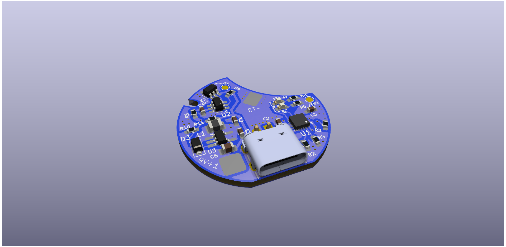

# lithium-battery-flashlight-adapter
Design for converting a flashlight powered by 6 AA batteries for 9v to a rechargable 26650 boosted up to 9v and with built in usb-c charging.

Needs an Output of 9v

space expressed as cylinder:
- 104mm height
- 30.7mm diameter

Stated manufacturer specs:
with 6 AA batteries in series for 9v,
battery life of 2hrs.
Assuming 2AH, that seems like an average continous draw of about 1A

Product page:
https://www.tractorsupply.com/tsc/product/surge-1-000-lumen-tactical-led-alkaline-flashlight-hhl3060as 

The AA battery holder has 2 pcb plates that interface with the LED and button, I'll be soldering to those to physically connect to the battery.

21700 Battery in interest:
https://www.18650batterystore.com/products/samsung-inr21700-58e-cc5493f101-5330mah-10-7a

26650 Battery in interest:
https://www.18650batterystore.com/products/sinowatt-70hp-26650-7000mah-14a-battery

# Plan:
1.  Create a circular pcb that boosts battery voltage to 9v and allows for usb-c recharging, does not have to do both at the same time.
2. Create 3D printing casing for adapter
3. solder adapter to interface plates that came with flashlight
4. profit?

PCB V1:

