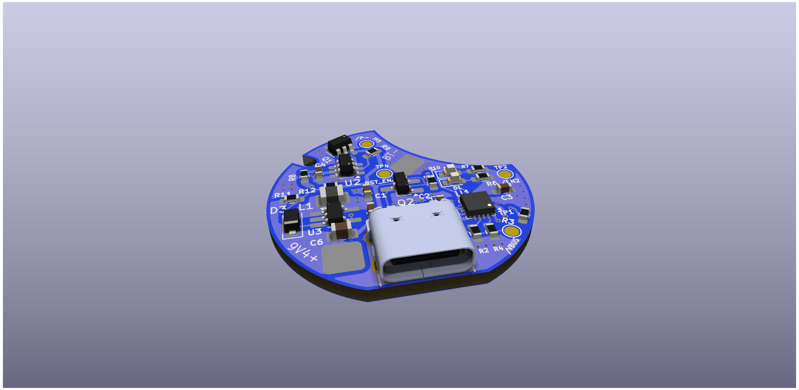
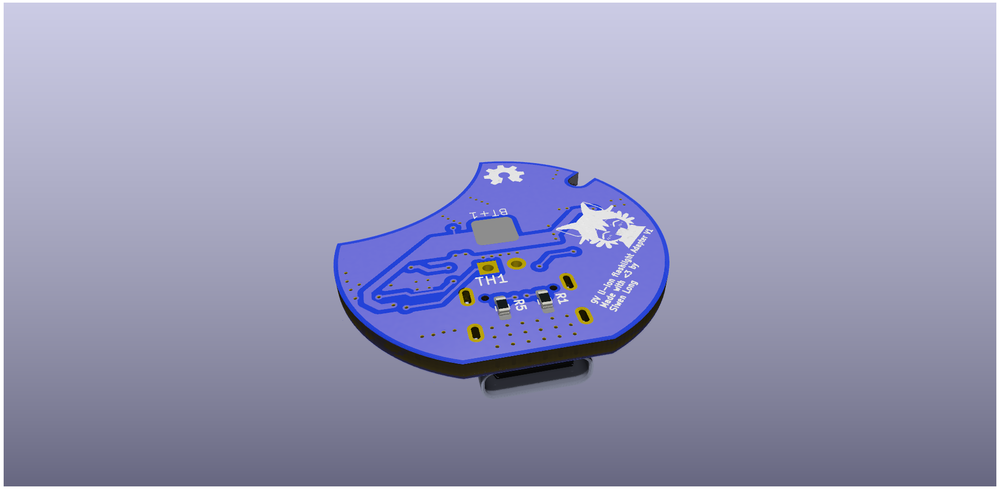

# lithium-battery-flashlight-adapter
Design that uses a custom pcb and 3D printing for converting a powerful surge brand flashlight powered by 6 AA batteries for 9v to a rechargable 26650 with usb-c charging.

Why?:
I don't like AA batteries :P
and I need a bright flashflight when I'm skating home at night

Original Flashlight  page:
https://www.tractorsupply.com/tsc/product/surge-1-000-lumen-tactical-led-alkaline-flashlight-hhl3060as 

26650 Battery in interest:
https://www.18650batterystore.com/products/sinowatt-70hp-26650-7000mah-14a-battery

Digikey parts list:
https://www.digikey.com/en/mylists/list/EGW4OOC67G

# Plan:
1.  (WE ARE HERE) Create a circular pcb that boosts battery voltage to 9v and allows for usb-c recharging, does not have to do both at the same time. 
2. Create 3D printing casing for adapter
3. assemble
4. profit?

PCB V1:

